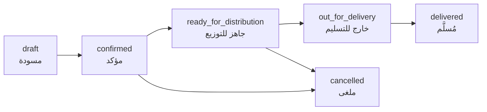
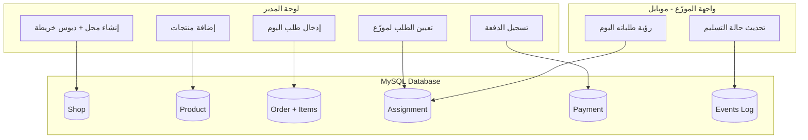
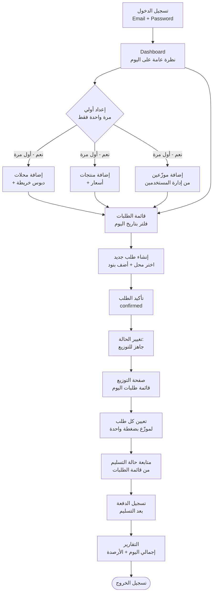
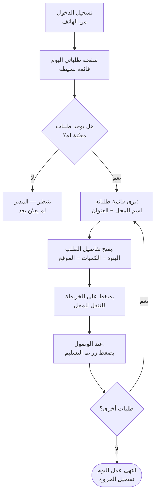

# تحليل متطلبات نظام BMS — الخطة الكاملة

## Tech Stack المحدد

- **Framework:** Next.js 14+ (App Router)
- **ORM:** Prisma
- **Database:** MySQL
- **Auth:** NextAuth.js (Credentials Provider — Email + Password)
- **UI:** shadcn/ui + Tailwind CSS (RTL)
- **Maps:** Google Maps API (Places + Geocoding + Maps JavaScript API)
- **Currency:** EUR
- **Language:** Arabic (RTL — `dir="rtl"`)

---

## هيكل قاعدة البيانات (Prisma Schema)

### الكيانات الرئيسية

**User**
- `id, name, email, passwordHash, role (ADMIN | DISTRIBUTOR), isActive, createdAt, updatedAt`

**Shop (محل)**
- `id, name, phone, email?, shopType, address (text), latitude, longitude, isActive, createdAt, updatedAt`

**Product (منتج)**
- `id, name, sku?, unit, unitPrice (Decimal), isActive, createdAt, updatedAt`
- علاقة: `ProductAuditLog` → من / متى / ماذا تغيّر

**Order (طلب)**
- `id, shopId, deliveryDate, status (OrderStatus), notes, createdById, createdAt, updatedAt`
- علاقة: `OrderItem` → `productId, quantity, unitPriceSnapshot, subtotal`
- علاقة: `OrderEvent` → سجل الأحداث (الفاعل، الطابع الزمني، الوصف)

**DistributionAssignment (تعيين)**
- `id, orderId, distributorId, vehicleId?, assignedById, assignedAt, notes`

**Vehicle (مركبة) — DB فقط بدون واجهة**
- `id, name, plateNumber, capacity?, isActive`

**Payment (دفعة)**
- `id, shopId, orderId?, amount (Decimal), method (CASH | BANK_TRANSFER | CHECK | OTHER), paymentDate, reference?, notes, createdById, createdAt`

### دورة حياة الطلب



---

## هيكل الصفحات (App Router)

```
app/
├── (auth)/
│   └── login/                  — صفحة تسجيل الدخول
│
├── (admin)/                    — محمية بـ middleware (ADMIN فقط)
│   ├── dashboard/              — نظرة عامة + إحصائيات
│   ├── shops/                  — قائمة + CRUD + خريطة Google Maps
│   │   └── [id]/edit/
│   ├── products/               — قائمة + CRUD + سجل التسعير
│   │   └── [id]/history/
│   ├── orders/                 — قائمة مفلترة بالتاريخ (قائمة العمل اليومية)
│   │   ├── new/
│   │   └── [id]/               — تفاصيل + سجل الأحداث + زر التعيين
│   ├── distribution/           — خطة التوزيع اليومية + التعيين اليدوي
│   ├── payments/               — قائمة + تسجيل دفعة جديدة
│   ├── reports/                — إجماليات يومية + أرصدة مستحقة
│   └── settings/users/         — إدارة المستخدمين والأدوار
│
├── (distributor)/              — محمية بـ middleware (DISTRIBUTOR فقط)
│   └── my-orders/              — طلبات اليوم المعيّنة له
│       └── [id]/               — تفاصيل + زر تحديث الحالة
│
└── api/
    ├── auth/[...nextauth]/
    ├── shops/[id]?/
    ├── products/[id]?/
    │   └── [id]/history/
    ├── orders/[id]?/
    │   ├── [id]/events/
    │   ├── [id]/status/
    │   └── [id]/assign/
    ├── distribution/
    ├── payments/[id]?/
    └── reports/
```

---

## تدفق بيانات العمليات الرئيسية



---

## الصلاحيات (RBAC)

| العملية | ADMIN | DISTRIBUTOR |
|---------|-------|-------------|
| إدارة المستخدمين | نعم | لا |
| CRUD المحلات والمنتجات | نعم | لا |
| إنشاء الطلبات | نعم | لا |
| قائمة العمل اليومية الكاملة | نعم | لا |
| تعيين الطلبات | نعم | لا |
| رؤية طلباته المعيّنة فقط | — | نعم |
| تحديث حالة التسليم | نعم | نعم (طلباته فقط) |
| تسجيل المدفوعات | نعم | لا |
| التقارير | نعم | لا |

---

## Middleware (حماية المسارات)

- `/login` — عام
- `/(admin)/*` — يتطلب ADMIN
- `/(distributor)/*` — يتطلب DISTRIBUTOR
- `/api/*` — يتطلب جلسة + التحقق من الدور داخل كل route

---

## القرارات المحسومة (النقاط المفتوحة سابقاً)

- **GPS عند التسليم:** لا — الموزّع يضغط فقط زر تحديث الحالة، بدون إرسال موقع.
- **المناطق (Zones):** لا — التعيين يدوي بالكامل طلب بطلب، بدون تقسيم جغرافي ثابت.
- **الضرائب البلجيكية:** لا — النظام مخفي ولا علاقة له بحسابات VAT.
- **الإشعارات:** لا — الموزّع يدخل التطبيق ويرى طلباته بنفسه.
- **البساطة:** الأولوية القصوى — أقل عدد من الخطوات لإنجاز كل مهمة.

---

## سيناريوهات العمل اليومي

### سيناريو 1 — المدير (يوم عمل كامل)



**الخطوات بالتفصيل:**

- الخطوة 1: يفتح المدير الموقع ويسجّل دخوله
- الخطوة 2: يرى Dashboard يعرض عدد طلبات اليوم + حالاتها
- الخطوة 3 (إعداد أولي فقط): يضيف المحلات والمنتجات والموزّعين مرة واحدة
- الخطوة 4: يفتح صفحة الطلبات ويختار تاريخ اليوم
- الخطوة 5: يُنشئ الطلبات (يختار المحل + يضيف المنتجات والكميات)
- الخطوة 6: يؤكد الطلبات ويغيّر حالتها إلى "جاهز للتوزيع"
- الخطوة 7: يفتح صفحة التوزيع ويعيّن كل طلب لموزّع بضغطة
- الخطوة 8: يتابع حالة التسليمات طوال اليوم من نفس الصفحة
- الخطوة 9: بعد التسليم يسجّل الدفعة (مبلغ + طريقة + مرجع)
- الخطوة 10: يراجع تقرير نهاية اليوم (إجماليات + أرصدة مستحقة)

---

### سيناريو 2 — الموزّع (يوم عمل كامل)



**الخطوات بالتفصيل:**

- الخطوة 1: يفتح المتصفح على هاتفه ويسجّل دخوله
- الخطوة 2: يرى مباشرةً قائمة طلبات اليوم المعيّنة له فقط
- الخطوة 3: يضغط على أي طلب ليرى: اسم المحل، العنوان، البنود والكميات
- الخطوة 4: يضغط على زر الخريطة للتنقل (يفتح Google Maps)
- الخطوة 5: بعد التسليم يضغط زر "تم التسليم" — تتغير الحالة تلقائياً
- الخطوة 6: يكمل باقي طلباته بنفس الطريقة حتى ينتهي

---

## ترتيب مراحل البناء

1. **الإعداد:** Next.js + Prisma + MySQL + NextAuth + shadcn/ui + RTL
2. **قاعدة البيانات:** Schema الكامل + migrations + seed data
3. **المصادقة:** تسجيل الدخول + middleware + RBAC
4. **المرحلة أ:** إدارة المستخدمين، المحلات (+ خريطة)، المنتجات
5. **المرحلة ب:** الطلبات (CRUD + قائمة يومية + سجل الأحداث)
6. **المرحلة ج:** التوزيع (تعيين + واجهة الموزّع)
7. **المرحلة د:** تحديث حالة التسليم (mobile-first)
8. **المرحلة هـ:** المدفوعات + تقارير الإجماليات والأرصدة
