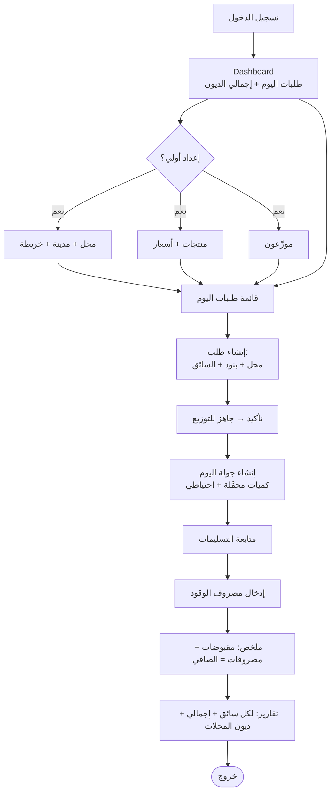
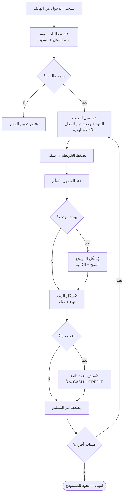

# BMS — خطة البناء الكاملة (الإصدار 3.0)

> **آخر تحديث:** 28 أبريل 2026 (الإصدار 3.1)
> **الوضع الحالي:** المراحل أ → هـ (الأساسي) مُنجزة ✅
> **التالي:** Schema v2 (OrderStatus+isGift+routeRunId) ← تعيين السائق ← الموزّع يُسجِّل الدفع+المرتجعات ← رصيد الدين ← جولة اليوم+node-cron ← التقارير

---

## Tech Stack ✅

- **Framework:** Next.js 14+ (App Router)
- **ORM:** Prisma v7
- **Database:** MySQL
- **Auth:** NextAuth.js (Credentials)
- **UI:** shadcn/ui + Tailwind CSS (RTL)
- **Maps:** Google Maps API
- **Currency:** EUR | **Language:** Arabic RTL

---

## القرارات المحسومة كاملة

| السؤال | القرار |
|--------|--------|
| متى يُعيَّن السائق؟ | **عند إنشاء الطلب** — dropdown في فورم الإنشاء |
| من يُسجِّل الدفع؟ | **الموزّع من الهاتف** (أساساً) + المدير من اللوحة |
| متى تُحدَّد طريقة الدفع؟ | **عند التسليم** — لا عند إنشاء الطلب |
| الدفع المجزأ؟ | **مسموح** — دفعتان (CASH + CREDIT) مرتبطتان بنفس الطلب |
| من يُسجِّل المرتجعات؟ | **الموزّع** من الميدان لحظة الرفض — عند الزبون مباشرةً |
| المرتجع يؤثر على قيمة الطلب؟ | **نعم** — قيمة التسليم = أصلية − مرتجع |
| الطلب الأصلي عند المرتجع؟ | **يبقى كما هو** — المرتجع سجل منفصل |
| رصيد الدين يُحسَب من؟ | **الطلبات المُسلَّمة فقط** (status=delivered) |
| حد الدين الأقصى؟ | **لا يوجد** — تنبيه مرئي فقط |
| الموزّع يرى رصيد الدين؟ | **نعم** — قراءة فقط لمساعدته على التحصيل |
| عدد الجولات في اليوم؟ | **متعدد** — كل سائق جولة مستقلة |
| الكمية الاحتياطية؟ | المدير أو السائق — لا فرق |
| تقرير المدير؟ | **إجمالي اليوم + تقرير لكل سائق على حدة** |
| طباعة أو PDF؟ | **لا** — غير مطلوب |
| VAT؟ | **لا تُحتسب إطلاقاً** |
| GPS؟ | **لا** — زر تحديث الحالة فقط |
| الهدايا؟ | **OrderItem مع isGift=true** — تُحتسب في حمولة السيارة، لا تؤثر على قيمة الزبون |
| دورة حياة الطلب؟ | **`ready_for_distribution` → `out_for_delivery` → `delivered` / `cancelled`** — لا draft ولا confirmed |
| الطلب عند الإنشاء؟ | يذهب فوراً لـ **`ready_for_distribution`** |
| متى يصير الطلب `out_for_delivery`؟ | عند إنشاء **RouteRun** (تلقائياً 6 صباحاً أو يدوياً) — تُحوَّل جميع طلبات السائق دفعةً واحدة |
| جولة اليوم تُنشأ كيف؟ | **node-cron داخلي** الساعة 6 صباحاً + **زر يدوي** من لوحة المدير |

---

## هيكل قاعدة البيانات

### Schema v1 — موجود حالياً ✅

```
User                   — ADMIN | DISTRIBUTOR
Shop                   — محلات + خريطة
Product                — منتجات + ProductAuditLog
Order                  — طلبات + OrderItem + OrderEvent
DistributionAssignment — تعيين طلب لموزّع + مركبة
Vehicle                — مركبات
Payment                — CASH | BANK_TRANSFER | CHECK | OTHER
```

> **ملاحظة على دورة الحياة الحالية:** الكود الموجود يستخدم `DRAFT → CONFIRMED → READY_FOR_DISTRIBUTION → OUT_FOR_DELIVERY → DELIVERED / CANCELLED`.
> **بعد v2:** يُحذف DRAFT وCONFIRMED — الطلب يبدأ مباشرةً من `READY_FOR_DISTRIBUTION`.

### Schema v2 — التعديلات المطلوبة ⏳

#### 1. `Shop` — إضافة المدينة

```prisma
model Shop {
  // ... الحقول الحالية ...
  city String  // المدينة / المنطقة — إلزامي
}
```

#### 2. `OrderStatus` — تبسيط دورة الحياة

```prisma
enum OrderStatus {
  READY_FOR_DISTRIBUTION  // الحالة الافتراضية عند إنشاء الطلب
  OUT_FOR_DELIVERY        // بعد إنشاء RouteRun — تُحوَّل آلياً
  DELIVERED               // بعد ضغط الموزّع "تم التسليم"
  CANCELLED               // إلغاء من المدير
  // DRAFT و CONFIRMED محذوفان — لم تعد مطلوبة
}
```

#### 3. `PaymentMethod` — توسيع enum

```prisma
enum PaymentMethod {
  CASH           // نقداً
  BANK_TRANSFER  // بالبنك
  CREDIT         // دين — لا مبلغ مُستلَم، يُضاف للرصيد
  INSTALLMENT    // دفعة على الدين القديم
  SETTLEMENT     // تسديد الرصيد المتراكم
}
```

#### 4. `OrderItem` — إضافة isGift

```prisma
model OrderItem {
  // ... الحقول الحالية (orderId, productId, quantity, unitPriceSnapshot) ...
  isGift Boolean @default(false)
  // isGift=true: الكمية تُحتسب في حمولة السيارة فقط، لا تدخل في قيمة الفاتورة ولا رصيد الدين
}
```

#### 5. `Order` — إضافة distributorId و routeRunId

```prisma
model Order {
  // ... الحقول الحالية ...
  status        OrderStatus @default(READY_FOR_DISTRIBUTION)  // الافتراضي الجديد
  distributorId String?     // السائق المُعيَّن عند الإنشاء
  routeRunId    String?     // تُملأ تلقائياً عند إنشاء RouteRun
  distributor   User?       @relation("OrderDistributor", fields: [distributorId], references: [id])
  routeRun      RouteRun?   @relation(fields: [routeRunId], references: [id])
  returns       OrderReturn[]
  payments      Payment[]
}
```

> **ملاحظة:** `DistributionAssignment` يبقى كما هو للتوافق — عند إنشاء الطلب مع سائق يُنشأ assignment تلقائياً.

#### 6. `OrderReturn` — مرتجعات مرتبطة بالطلب (ليس بالجولة)

```prisma
model OrderReturn {
  id          String   @id @default(cuid())
  orderId     String
  productId   String
  quantity    Int
  reason      String?
  createdById String   // الموزّع الذي سجّل المرتجع — عند الزبون مباشرةً
  createdAt   DateTime @default(now())

  order     Order   @relation(fields: [orderId], references: [id], onDelete: Cascade)
  product   Product @relation(fields: [productId], references: [id])
  createdBy User    @relation(fields: [createdById], references: [id])

  @@map("order_returns")
}
```

#### 7. `RouteRun` — جولة اليوم (وحدة تجميع وملخص)

```prisma
model RouteRun {
  id              String   @id @default(cuid())
  date            DateTime @db.Date
  distributorId   String
  vehicleId       String?
  whiteBagsLoaded Int      @default(0)
  brownBagsLoaded Int      @default(0)
  reserveBags     Int      @default(0)
  notes           String?  @db.Text
  createdAt       DateTime @default(now())

  distributor User           @relation(fields: [distributorId], references: [id])
  vehicle     Vehicle?       @relation(fields: [vehicleId], references: [id])
  orders      Order[]        // الطلبات المرتبطة — تُملأ عند إنشاء الجولة
  expenses    RouteExpense[]

  @@map("route_runs")
}
```

> **آلية الإنشاء:** عند إنشاء RouteRun (node-cron الساعة 6 صباحاً أو يدوياً):
> 1. تُجمَع كل طلبات هذا السائق بحالة `READY_FOR_DISTRIBUTION` في ذلك اليوم
> 2. يُضبط `Order.routeRunId` لكل منها
> 3. يتغير status كل منها إلى `OUT_FOR_DELIVERY` آلياً

#### 8. `RouteExpense` — مصروفات الجولة (ديزل...)

```prisma
enum ExpenseType { FUEL OTHER }

model RouteExpense {
  id         String      @id @default(cuid())
  routeRunId String
  type       ExpenseType @default(FUEL)
  amount     Decimal     @db.Decimal(10, 2)
  note       String?
  createdAt  DateTime    @default(now())

  routeRun RouteRun @relation(fields: [routeRunId], references: [id])

  @@map("route_expenses")
}
```

### صيغة حساب رصيد الدين (ديناميكي — لا جدول)

```
رصيد_الدين(محل) =
  SUM( (OrderItem.quantity - OrderReturn.quantity) × OrderItem.unitPriceSnapshot )
    WHERE Order.shopId = X
      AND Order.status = 'delivered'
      AND Payment linked to order has method IN ('CREDIT')
  −
  SUM( Payment.amount )
    WHERE Payment.shopId = X
      AND Payment.method IN ('CASH', 'BANK_TRANSFER', 'INSTALLMENT', 'SETTLEMENT')
```

---

## الصلاحيات المحدَّثة (RBAC)

| العملية | ADMIN | DISTRIBUTOR |
|---------|-------|-------------|
| إدارة المستخدمين والمحلات والمنتجات | ✅ | ❌ |
| إنشاء الطلبات + تعيين السائق | ✅ | ❌ |
| قائمة الطلبات الكاملة | ✅ | ❌ |
| إنشاء جولة اليوم (RouteRun) | ✅ | ❌ |
| إدخال مصروفات الوقود | ✅ | ❌ |
| التقارير الكاملة | ✅ | ❌ |
| رؤية طلباته المعيّنة فقط | ❌ | ✅ |
| رؤية رصيد دين المحل (قراءة) | ✅ | ✅ |
| **تسجيل الدفع (طلباته فقط)** | ✅ | **✅ جديد** |
| **تسجيل المرتجعات (طلباته فقط)** | ✅ | **✅ جديد** |
| تحديث حالة التسليم (طلباته فقط) | ✅ | ✅ |

---

## السيناريو 1 — المدير (يوم عمل كامل)



**الخطوات التفصيلية:**

1. يفتح الداشبورد → يرى: طلبات اليوم + إجمالي الديون المتراكمة
2. _(مرة واحدة)_ يُضيف المحلات + مدن + خريطة، المنتجات، الموزّعين
3. يُنشئ طلبات اليوم ليلاً — لكل طلب: محل + بنود + كميات + **اختيار السائق** + ملاحظات
   - الهدايا: يُضيف بنداً بـ `isGift=true` لمنتج معيّن
   - الطلب يُحفظ مباشرةً بحالة **`READY_FOR_DISTRIBUTION`** — لا خطوات إضافية
4. في الساعة **6 صباحاً**: node-cron يُنشئ جولة لكل سائق تلقائياً
   - أو المدير يضغط «إنشاء جولات اليوم» يدوياً
   - جميع طلبات السائق تتحول لـ **`OUT_FOR_DELIVERY`** آلياً
5. يتابع حالة التسليمات على مدار اليوم
6. عند انتهاء الجولة: يُدخل مصروف الوقود
7. يراجع **ملخص الجولة**: مقبوضات − مصروفات = **الصافي**
8. يراجع **التقارير**: لكل سائق على حدة + الإجمالي + ديون المحلات

---

## السيناريو 2 — الموزّع (يوم عمل كامل)



**الخطوات التفصيلية:**

1. يفتح المتصفح على هاتفه → يُسجِّل دخوله
2. يرى قائمة طلباته مرتّبة (حالة: `OUT_FOR_DELIVERY`): اسم المحل + المدينة
3. يفتح تفاصيل الطلب:
   - البنود والكميات (بما فيها بنود الهدية مُمَيَّزة)
   - **رصيد دين المحل** (قراءة فقط)
   - ملاحظات وتعليمات
4. يضغط الخريطة → ينتقل للمحل (Google Maps)
5. **عند الوصول — بالترتيب:**
   - **أولاً:** لو رُفض جزء من الطلب → يُسجِّل المرتجع **فوراً عند الزبون** (منتج + كمية)
   - **ثانياً:** يُسجِّل الدفع: يختار النوع + المبلغ
   - **لو دفع مجزأ:** يُضيف دفعة ثانية (مثلاً 50€ نقد + 41€ دين)
   - **أخيراً:** يضغط **«تم التسليم»** — الحالة تصبح `DELIVERED`
6. يكرر مع باقي الطلبات
7. يعود للمستودع — المدير يُدخل مصروف الوقود ويرى الملخص

---

## هيكل الصفحات

```
app/
├── (auth)/login/                         ✅

├── (admin)/
│   ├── dashboard/                        ✅ — يحتاج: بطاقة إجمالي الديون + صافي اليوم
│   ├── shops/                            ✅
│   │   ├── new/                          ✅ — يحتاج: حقل المدينة
│   │   ├── [id]/edit/                    ✅ — يحتاج: حقل المدينة
│   │   └── [id]/                         ✅ — يحتاج: بطاقة رصيد الدين
│   ├── products/                         ✅
│   │   └── [id]/history/                 ✅
│   ├── orders/                           ✅
│   │   ├── new/                          ✅ — يحتاج: dropdown السائق
│   │   └── [id]/                         ✅ — يحتاج: رصيد المحل + سجل المرتجعات
│   ├── distribution/                     ✅
│   │   └── route-runs/                   ⏳ جديدة
│   │       ├── new/                      ⏳ إنشاء جولة (سائق + سيارة + كميات)
│   │       └── [id]/                     ⏳ تفاصيل + مصروفات + ملخص الصافي
│   ├── payments/                         ✅ — يحتاج: دعم CREDIT/INSTALLMENT/SETTLEMENT
│   ├── reports/                          ✅ — يحتاج: تقرير لكل سائق + ديون المحلات
│   └── settings/users/                   ✅

├── (distributor)/
│   └── my-orders/                        ✅
│       └── [id]/                         ✅ — يحتاج: رصيد دين + تسجيل دفع + مرتجع

└── api/
    ├── auth/[...nextauth]/               ✅
    ├── shops/                            ✅ — يحتاج: حقل city
    │   └── [id]/balance/                 ⏳ حساب رصيد الدين
    ├── products/                         ✅
    ├── orders/                           ✅ — يحتاج: distributorId عند الإنشاء
    │   └── [id]/
    │       ├── events/                   ✅
    │       ├── status/                   ✅
    │       ├── assign/                   ✅
    │       ├── payments/                 ⏳ POST — الموزّع يُسجِّل دفعاً
    │       └── returns/                  ⏳ GET/POST — المرتجعات
    ├── distribution/                     ✅
    ├── route-runs/                       ⏳
    │   └── [id]/
    │       └── expenses/                 ⏳
    ├── payments/                         ✅ — يحتاج: CREDIT/INSTALLMENT/SETTLEMENT
    └── reports/                          ✅ — يحتاج: تقرير الديون + لكل سائق
```

---

## خارطة الطريق — الأولويات بالتسلسل

### الأولوية 1 — Schema v2 + Migration ⏳

**الهدف:** تجهيز قاعدة البيانات لكل الميزات الجديدة دفعة واحدة.

- [ ] تبسيط enum `OrderStatus`: حذف `DRAFT` و`CONFIRMED`، الافتراضي = `READY_FOR_DISTRIBUTION`
- [ ] إضافة `isGift Boolean @default(false)` لـ `OrderItem`
- [ ] إضافة `city String` لـ `Shop`
- [ ] إضافة `distributorId String?` و`routeRunId String?` لـ `Order`
- [ ] توسيع enum `PaymentMethod`: أضف `CREDIT, INSTALLMENT, SETTLEMENT`
- [ ] إنشاء موديل `OrderReturn`
- [ ] إنشاء موديل `RouteRun` (مع علاقة `orders Order[]`)
- [ ] إنشاء موديل `RouteExpense`
- [ ] تشغيل: `prisma migrate dev --name v2_full_features`
- [ ] تحديث `seed.ts` بأمثلة واقعية (هدية + دين + تسديد)

---

### الأولوية 2 — تعيين السائق عند إنشاء الطلب ⏳

**الهدف:** المدير يختار السائق في نفس فورم الطلب.

- [ ] تحديث `app/(admin)/orders/new/page.tsx` — إضافة dropdown اختيار السائق
- [ ] تحديث `app/api/orders/route.ts` (POST) — حفظ `distributorId` + إنشاء `DistributionAssignment` تلقائياً
- [ ] تحديث صفحة تفاصيل الطلب — إظهار اسم السائق المُعيَّن

---

### الأولوية 3 — واجهة الموزّع: دفع + مرتجعات ⏳

**الهدف:** الموزّع يُسجِّل الدفع والمرتجعات من الهاتف.

**صفحة `(distributor)/my-orders/[id]/`:**
- [ ] إضافة بطاقة **رصيد دين المحل** (fetch من `/api/shops/[id]/balance`)
- [ ] إضافة فورم **تسجيل الدفع**: نوع + مبلغ (+ دفعة ثانية لو مجزأ)
- [ ] إضافة فورم **تسجيل المرتجع**: منتج + كمية + سبب (اختياري)
- [ ] ترتيب UX: مرتجع → دفع → تم التسليم

**API routes جديدة:**
- [ ] `POST /api/orders/[id]/payments` — الموزّع يُسجِّل دفعاً (يتحقق: الطلب مُعيَّن له)
- [ ] `POST /api/orders/[id]/returns` — الموزّع يُسجِّل مرتجعاً
- [ ] `GET /api/orders/[id]/returns` — جلب مرتجعات الطلب

---

### الأولوية 4 — رصيد الدين ⏳

**الهدف:** عرض رصيد الدين في كل مكان مناسب.

- [ ] `GET /api/shops/[id]/balance` — حساب الرصيد ديناميكياً
- [ ] صفحة المحل `/admin/shops/[id]/` — بطاقة «رصيد الدين الحالي»
- [ ] قائمة الطلبات — عمود «رصيد دين المحل» بجانب اسمه
- [ ] Dashboard — بطاقة «إجمالي الديون المتراكمة»
- [ ] تقرير الديون — جدول المحلات مرتّب تنازلياً حسب الرصيد

---

### الأولوية 5 — جولة اليوم (RouteRun) ⏳

**الهدف:** تجميع الجولة + حساب الصافي + إنشاء تلقائي بـ cron.

- [ ] تثبيت `node-cron` كـ dependency
- [ ] إنشاء `lib/cron.ts` — يُهيَّأ في `app/layout.tsx` (أو في custom server)
- [ ] `POST /api/route-runs/auto-create` — يُنشئ جولات لكل سائق له طلبات `READY_FOR_DISTRIBUTION` اليوم + يُحوِّلها لـ `OUT_FOR_DELIVERY`
- [ ] `POST /api/route-runs` — إنشاء جولة يدوياً (نفس المنطق)
- [ ] `GET /api/route-runs/[id]` — تفاصيل الجولة
- [ ] `POST /api/route-runs/[id]/expenses` — إضافة مصروف
- [ ] صفحة `/admin/distribution/route-runs/new` — فورم إنشاء يدوي + زر «إنشاء جولات اليوم» (يستدعي auto-create)
- [ ] صفحة `/admin/distribution/route-runs/[id]` — تفاصيل + مصروفات + **ملخص: مقبوضات − مصروفات = الصافي**
- [ ] رابط من صفحة distribution الحالية لإنشاء جولة جديدة

---

### الأولوية 6 — تحديث المحلات وإضافة المدينة ⏳

- [ ] تحديث فورم إنشاء المحل — إضافة حقل `city`
- [ ] تحديث فورم تعديل المحل — إضافة حقل `city`
- [ ] إضافة مدن افتراضية للـ seed (دندرموند، سنت كلاس، برخم...)

---

### الأولوية 7 — تحديث التقارير ⏳

- [ ] تقرير إجمالي اليوم: مقبوضات كاملة لجميع السائقين
- [ ] تقرير لكل سائق: ما وزّعه + ما جمعه + مصروفاته + صافيه
- [ ] تقرير ديون المحلات: جدول + ترتيب + فلتر

---

## ملاحظات تقنية للتنفيذ

| القاعدة | التفاصيل |
|---------|----------|
| رصيد الدين | لا يُخزَّن — يُحسَب دائماً من `Order JOIN Payment JOIN OrderReturn` |
| الهدايا | `OrderItem` مع `isGift=true` — تُحتسب في حمولة السيارة فقط، مُستثناة من قيمة الفاتورة ورصيد الدين |
| CREDIT payment | لا يوجد مبلغ مُستلَم — `amount = 0` أو null، يُحسَب من قيمة الطلب |
| الدفع المجزأ | دفعتان مستقلتان مرتبطتان بـ `orderId` نفسه في جدول `payments` |
| OrderReturn | مرتبط بـ `orderId` — يُسجَّله الموزّع عند الزبون لحظة الرفض، قبل الضغط على "تم التسليم" |
| RouteRun + node-cron | `node-cron` يشتغل داخل التطبيق — ينفّذ `POST /api/route-runs/auto-create` كل يوم الساعة 6 صباحاً |
| OrderStatus | عند إنشاء الطلب: `READY_FOR_DISTRIBUTION` — عند إنشاء RouteRun: `OUT_FOR_DELIVERY` — عند التسليم: `DELIVERED` |
| isGift في حساب الرصيد | `OrderItem` بـ `isGift=true` تُستثنى من `unitPriceSnapshot × quantity` في صيغة حساب الدين |
| Migration | `prisma migrate dev --name v2_full_features` |
| seed.ts | أضف مدن واقعية + مثال دين + مثال تسديد رصيد + مثال هدية (isGift=true) |
