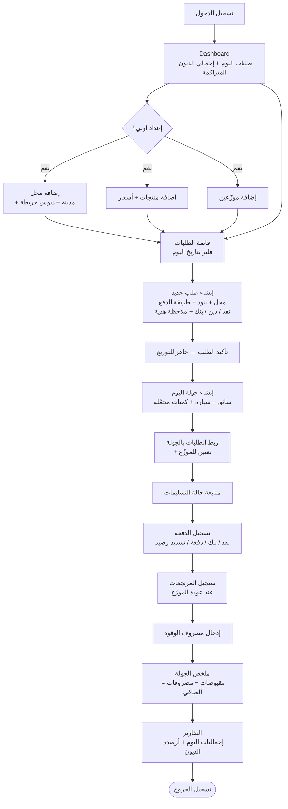
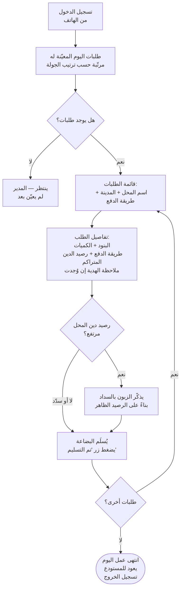

# BMS — خطة البناء الكاملة (الإصدار 2.0)

> **آخر تحديث:** 28 أبريل 2026
> **الوضع الحالي:** المراحل أ → هـ (الأساسي) مُنجزة ✅ — نبدأ الآن في إضافة الميزات المستخلصة من الواقع التشغيلي الفعلي.

---

## Tech Stack المحدد

- **Framework:** Next.js 14+ (App Router) ✅
- **ORM:** Prisma v7 ✅
- **Database:** MySQL ✅
- **Auth:** NextAuth.js (Credentials Provider — Email + Password) ✅
- **UI:** shadcn/ui + Tailwind CSS (RTL) ✅
- **Maps:** Google Maps API (Places + Geocoding + Maps JavaScript API)
- **Currency:** EUR ✅
- **Language:** Arabic (RTL — `dir="rtl"`) ✅

---

## القرارات المحسومة

| السؤال | القرار |
|--------|--------|
| GPS عند التسليم | لا — زر تحديث الحالة فقط |
| المناطق (Zones) | لا — تعيين يدوي بالكامل |
| الضرائب البلجيكية (VAT) | **لا تُحتسب إطلاقاً** |
| الإشعارات | لا — الموزّع يدخل التطبيق ويرى طلباته |
| البساطة | الأولوية القصوى |
| رصيد الدين: يُحسَب من؟ | **الطلبات المُسلَّمة فقط** (status = delivered) |
| الهدايا: كيف تُسجَّل؟ | **ملاحظة على الطلب** (حقل notes) — لا بند مستقل |
| الموزّع يرى رصيد الدين؟ | **نعم** — يظهر في صفحة تفاصيل الطلب لمساعدته على تحصيل الدين |
| حد الدين الأقصى | **لا يوجد** — تنبيه فقط بدون وقف التسليم |

---

## هيكل قاعدة البيانات

### ما هو موجود حالياً (Schema v1) ✅

```
User          — المستخدمون (ADMIN | DISTRIBUTOR)
Shop          — المحلات + موقع خريطة
Product       — المنتجات + سجل الأسعار (ProductAuditLog)
Order         — الطلبات + بنودها (OrderItem) + أحداثها (OrderEvent)
DistributionAssignment — تعيين طلب لموزّع + مركبة
Vehicle       — المركبات
Payment       — المدفوعات (CASH | BANK_TRANSFER | CHECK | OTHER)
```

### التعديلات المطلوبة (Schema v2) ⏳

#### 1. تعديل موديل `Shop` — إضافة المدينة

```prisma
model Shop {
  // ... الحقول الحالية ...
  city      String   // المدينة / المنطقة (دندرموند، سنت كلاس، برخم...)
  // رصيد الدين: محسوب ديناميكياً لا مخزَّن
}
```

#### 2. تعديل enum `PaymentMethod` — إضافة أنواع الدفع الجديدة

```prisma
enum PaymentMethod {
  CASH           // نقداً — مبلغ فوري عند التسليم
  BANK_TRANSFER  // بالبنك — تحويل إلكتروني
  CREDIT         // دين — استلم ولم يدفع (يُضاف للرصيد)
  INSTALLMENT    // دفعة جزئية — قسط على الدين القديم
  SETTLEMENT     // تسديد رصيد — سداد الدين المتراكم
}
```

#### 3. تعديل موديل `Order` — إضافة حالة الدفع

```prisma
model Order {
  // ... الحقول الحالية ...
  paymentMethod  PaymentMethod  @default(CASH)
  // ملاحظة: حقل notes الحالي يستوعب الهدايا (كيس هدية الأسبوع)
}
```

#### 4. موديل جديد `RouteRun` — جولة اليوم

```prisma
model RouteRun {
  id              String   @id @default(cuid())
  date            DateTime @db.Date
  distributorId   String
  vehicleId       String?
  whiteBagsLoaded Int      @default(0)  // أكياس أبيض محمَّلة
  brownBagsLoaded Int      @default(0)  // أكياس أسمر محمَّلة
  reserveBags     Int      @default(0)  // كمية احتياطية
  notes           String?  @db.Text
  createdAt       DateTime @default(now())

  distributor User          @relation(fields: [distributorId], references: [id])
  vehicle     Vehicle?      @relation(fields: [vehicleId], references: [id])
  assignments RouteRunOrder[]  // الطلبات المرتبطة بالجولة
  returns     RouteReturn[]
  expenses    RouteExpense[]

  @@map("route_runs")
}

// جدول وسيط يربط الجولة بالطلبات
model RouteRunOrder {
  routeRunId String
  orderId    String
  sortOrder  Int      @default(0)  // ترتيب التسليم

  routeRun RouteRun @relation(fields: [routeRunId], references: [id])
  order    Order    @relation(fields: [orderId], references: [id])

  @@id([routeRunId, orderId])
  @@map("route_run_orders")
}
```

#### 5. موديل جديد `RouteReturn` — المرتجعات

```prisma
model RouteReturn {
  id         String   @id @default(cuid())
  routeRunId String
  productId  String
  quantity   Int
  reason     String?
  createdAt  DateTime @default(now())

  routeRun RouteRun @relation(fields: [routeRunId], references: [id])
  product  Product  @relation(fields: [productId], references: [id])

  @@map("route_returns")
}
```

#### 6. موديل جديد `RouteExpense` — مصروفات الجولة

```prisma
enum ExpenseType {
  FUEL    // ديزل / وقود
  OTHER   // مصاريف أخرى
}

model RouteExpense {
  id         String      @id @default(cuid())
  routeRunId String
  type       ExpenseType @default(FUEL)
  amount     Decimal     @db.Decimal(10, 2)
  note       String?
  createdAt  DateTime    @default(now())

  routeRun RouteRun @relation(fields: [routeRunId], references: [id])

  @@map("route_expenses")
}
```

### صيغة حساب رصيد الدين (ديناميكي — لا جدول مستقل)

```
رصيد الدين للمحل =
  SUM(OrderItem.subtotal WHERE Order.shopId = X AND Order.status = 'delivered' AND Order.paymentMethod IN ['CREDIT', 'INSTALLMENT'])
  −
  SUM(Payment.amount WHERE Payment.shopId = X AND Payment.method IN ['CASH', 'BANK_TRANSFER', 'INSTALLMENT', 'SETTLEMENT'])
```

---

## دورة حياة الطلب (بدون تغيير)

```
draft → confirmed → ready_for_distribution → out_for_delivery → delivered
                                                              → cancelled
```

---

## هيكل الصفحات المحدَّث

```
app/
├── (auth)/
│   └── login/                        ✅ مكتملة

├── (admin)/
│   ├── dashboard/                    ✅ مكتملة — يحتاج: إضافة بطاقة "إجمالي الديون اليوم"
│   ├── shops/                        ✅ مكتملة
│   │   ├── new/                      ✅ — يحتاج: إضافة حقل المدينة
│   │   ├── [id]/edit/                ✅ — يحتاج: إضافة حقل المدينة
│   │   └── [id]/                     ✅ — يحتاج: إضافة بطاقة رصيد الدين
│   ├── products/                     ✅ مكتملة
│   │   └── [id]/history/             ✅ مكتملة
│   ├── orders/                       ✅ مكتملة
│   │   ├── new/                      ✅ — يحتاج: إضافة حقل paymentMethod
│   │   └── [id]/                     ✅ — يحتاج: إظهار paymentMethod + رصيد المحل
│   ├── distribution/                 ✅ مكتملة
│   │   └── route-runs/               ⏳ جديدة — إنشاء وإدارة جولة اليوم
│   │       ├── new/                  ⏳ — إنشاء جولة (سائق + سيارة + كميات محمَّلة)
│   │       └── [id]/                 ⏳ — تفاصيل الجولة + إضافة مرتجعات + مصروفات + ملخص الصافي
│   ├── payments/                     ✅ مكتملة — يحتاج: دعم أنواع الدفع الجديدة
│   ├── reports/                      ✅ مكتملة — يحتاج: تقرير أرصدة الديون
│   └── settings/users/               ✅ مكتملة

├── (distributor)/
│   └── my-orders/                    ✅ مكتملة
│       └── [id]/                     ✅ — يحتاج: إظهار رصيد دين المحل + paymentMethod

└── api/
    ├── auth/[...nextauth]/           ✅
    ├── shops/[id]?/                  ✅ — يحتاج: إضافة city + حساب balance
    ├── products/[id]?/               ✅
    │   └── [id]/history/             ✅
    ├── orders/[id]?/                 ✅ — يحتاج: دعم paymentMethod
    │   ├── [id]/events/              ✅
    │   ├── [id]/status/              ✅
    │   └── [id]/assign/              ✅
    ├── distribution/                 ✅
    ├── route-runs/                   ⏳ جديد
    │   └── [id]/
    │       ├── returns/              ⏳ جديد
    │       └── expenses/             ⏳ جديد
    ├── payments/                     ✅ — يحتاج: دعم أنواع الدفع الجديدة
    ├── shops/[id]/balance/           ⏳ جديد — حساب رصيد الدين
    └── reports/                      ✅ — يحتاج: تقرير الديون
```

---

## الصلاحيات (RBAC) — محدَّث

| العملية | ADMIN | DISTRIBUTOR |
|---------|-------|-------------|
| إدارة المستخدمين | نعم | لا |
| CRUD المحلات والمنتجات | نعم | لا |
| إنشاء الطلبات | نعم | لا |
| قائمة العمل اليومية الكاملة | نعم | لا |
| تعيين الطلبات | نعم | لا |
| إنشاء جولة اليوم (RouteRun) | نعم | لا |
| تسجيل المرتجعات والمصروفات | نعم | لا |
| رؤية طلباته المعيّنة فقط | — | نعم |
| رؤية رصيد دين المحل عند التسليم | — | نعم (قراءة فقط) |
| تحديث حالة التسليم | نعم | نعم (طلباته فقط) |
| تسجيل المدفوعات | نعم | لا |
| التقارير | نعم | لا |

---

## سيناريو 1 — المدير (يوم عمل كامل) — محدَّث



**الخطوات التفصيلية (المدير):**

- **1** يفتح الداشبورد → يرى: طلبات اليوم، حالاتها، إجمالي الديون المتراكمة على المحلات
- **2** _(إعداد أولي مرة واحدة)_ يضيف المحلات (+ مدينة + خريطة) والمنتجات والموزّعين
- **3** يفتح قائمة الطلبات ← يختار تاريخ اليوم
- **4** يُنشئ طلباً لكل محل: يختار المحل + يضيف البنود والكميات + **يحدد طريقة الدفع (نقد / دين / بنك)** + يكتب ملاحظة الهدية إن وُجدت
- **5** يؤكد الطلبات → يحوّلها إلى «جاهز للتوزيع»
- **6** يُنشئ **جولة اليوم** (RouteRun): يختار السائق والسيارة ويدخل الكميات المحمَّلة
- **7** يربط الطلبات بالجولة ويُعيّنها للموزّع
- **8** يتابع حالة التسليمات طوال اليوم
- **9** بعد كل تسليم يسجّل الدفعة بالنوع الصحيح:
  - CASH: مبلغ نقدي
  - BANK_TRANSFER: تحويل مع مرجع
  - CREDIT: لا مبلغ — يُضاف للرصيد
  - INSTALLMENT: مبلغ إضافي على القديم
  - SETTLEMENT: تسديد كامل أو جزئي للرصيد المتراكم
- **10** عند عودة الموزّع: يسجّل **المرتجعات** (كميات + نوع المنتج)
- **11** يُدخل **مصروف الوقود** (ديزل)
- **12** يراجع **ملخص الجولة**: مجموع المقبوضات − المصروفات = **الصافي**
- **13** يراجع **تقرير الديون**: المحلات مرتّبة حسب أعلى رصيد دين

---

## سيناريو 2 — الموزّع (يوم عمل كامل) — محدَّث



**الخطوات التفصيلية (الموزّع):**

- **1** يفتح المتصفح على هاتفه → يسجّل دخوله
- **2** يرى مباشرةً قائمة طلبات اليوم بترتيب الجولة: اسم المحل، المدينة، طريقة الدفع (نقد / دين / بنك)
- **3** يضغط على الطلب ليرى:
  - اسم المحل + عنوانه + مدينته
  - البنود والكميات
  - **طريقة الدفع المُحددة مسبقاً**
  - **رصيد الدين المتراكم على المحل** (من الطلبات المُسلَّمة السابقة)
  - ملاحظة الهدية إن وُجدت
- **4** يضغط زر الخريطة للتنقل (يفتح Google Maps)
- **5** عند الوصول: يُسلِّم البضاعة ← إن كان الزبون عليه رصيد دين يرى المبلغ ويذكّره
- **6** يضغط **«تم التسليم»** ← تتغير الحالة تلقائياً إلى delivered
- **7** يكرر الخطوات مع باقي المحلات بالترتيب
- **8** عند الانتهاء يعود للمستودع بالأكياس المرتجعة (يسجّلها المدير لاحقاً)

---

## ترتيب مراحل البناء — المحدَّث

### ✅ مكتملة (لا تحتاج إعادة بناء)

| # | المرحلة | الحالة |
|---|---------|--------|
| 1 | إعداد المشروع + قاعدة البيانات الأساسية | ✅ |
| 2 | Migration الأولى + Seed | ✅ |
| 3 | المصادقة (NextAuth + Middleware + RBAC) | ✅ |
| 4 | **المرحلة أ:** إدارة المستخدمين + المحلات + المنتجات | ✅ |
| 5 | **المرحلة ب:** الطلبات (CRUD + قائمة يومية + سجل الأحداث) | ✅ |
| 6 | **المرحلة ج:** التوزيع (تعيين + واجهة الموزّع) | ✅ |
| 7 | **المرحلة د:** تحديث حالة التسليم (mobile-first) | ✅ |
| 8 | **المرحلة هـ أساسي:** المدفوعات البسيطة + التقارير | ✅ |

---

### ⏳ المرحلة التالية — التعديلات المطلوبة (بالأولوية)

#### الأولوية 1 — تعديلات Schema + Migration جديدة

1. إضافة حقل `city` لموديل `Shop`
2. توسيع enum `PaymentMethod` بإضافة: `CREDIT`, `INSTALLMENT`, `SETTLEMENT`
3. إضافة حقل `paymentMethod` لموديل `Order`
4. إضافة موديلات جديدة: `RouteRun`, `RouteRunOrder`, `RouteReturn`, `RouteExpense`
5. تشغيل `prisma migrate dev` + تحديث `seed.ts`

#### الأولوية 2 — رصيد الدين

1. إضافة endpoint `/api/shops/[id]/balance` — يحسب الرصيد ديناميكياً
2. تحديث صفحة تفاصيل المحل → عرض بطاقة رصيد الدين
3. تحديث قائمة الطلبات → عرض عمود «رصيد الدين» لكل طلب
4. تحديث Dashboard → بطاقة «إجمالي الديون المتراكمة اليوم»
5. تحديث تقرير الأرصدة → جدول المحلات مرتّب حسب الرصيد

#### الأولوية 3 — طريقة الدفع على الطلب

1. تحديث فورم إنشاء الطلب → dropdown لاختيار PaymentMethod
2. تحديث صفحة تفاصيل الطلب → عرض طريقة الدفع
3. تحديث واجهة الموزّع → عرض طريقة الدفع + رصيد الدين
4. تحديث صفحة المدفوعات → دعم الأنواع الجديدة (CREDIT, INSTALLMENT, SETTLEMENT)

#### الأولوية 4 — جولة اليوم (RouteRun)

1. صفحة `/admin/distribution/route-runs/new` — إنشاء جولة
2. صفحة `/admin/distribution/route-runs/[id]` — تفاصيل + ربط طلبات + ملخص
3. API endpoints: `POST /api/route-runs`, `GET/PATCH /api/route-runs/[id]`
4. تحديث صفحة التوزيع → ربط الطلبات بالجولة تلقائياً

#### الأولوية 5 — المرتجعات والمصروفات

1. فورم تسجيل المرتجعات في صفحة تفاصيل الجولة
2. فورم تسجيل مصروف الوقود في نفس الصفحة
3. حساب وعرض: مقبوضات − مصروفات = **الصافي** في ملخص الجولة
4. API endpoints: `POST /api/route-runs/[id]/returns`, `POST /api/route-runs/[id]/expenses`

#### الأولوية 6 — تحديثات الداشبورد والتقارير

1. Dashboard: بطاقات جديدة (إجمالي الديون + صافي اليوم)
2. تقرير ديون المحلات: جدول + ترتيب حسب الرصيد
3. تقرير جولة اليوم: مقبوضات + مرتجعات + مصروفات + صافي

---

## تدفق البيانات المحدَّث

```mermaid
flowchart TD
    subgraph admin [لوحة المدير]
        A1[إنشاء محل + مدينة + دبوس]
        A2[إضافة منتجات]
        A3[إدخال طلب + طريقة الدفع + ملاحظة هدية]
        A4[إنشاء جولة اليوم RouteRun]
        A5[تعيين الطلبات للجولة]
        A6[تسجيل دفعة CASH/BANK/CREDIT/INSTALLMENT/SETTLEMENT]
        A7[تسجيل مرتجعات]
        A8[تسجيل مصروف وقود]
    end

    subgraph dist [واجهة الموزّع - موبايل]
        D1[رؤية طلباته اليوم + ترتيب الجولة]
        D2[رؤية رصيد دين المحل عند التسليم]
        D3[تحديث حالة التسليم]
    end

    subgraph db [MySQL Database]
        DB1[(Shop + city)]
        DB2[(Product)]
        DB3[(Order + paymentMethod)]
        DB4[(DistributionAssignment)]
        DB5[(Payment)]
        DB6[(OrderEvent)]
        DB7[(RouteRun)]
        DB8[(RouteReturn)]
        DB9[(RouteExpense)]
    end

    A1 --> DB1
    A2 --> DB2
    A3 --> DB3
    A4 --> DB7
    A5 --> DB4
    D1 --> DB4
    D2 --> DB3
    D3 --> DB6
    A6 --> DB5
    A7 --> DB8
    A8 --> DB9
```



---

## ملاحظات تقنية للتنفيذ

- **رصيد الدين:** لا تُخزِّنه في عمود — احسبه دائماً من `ORDER JOIN PAYMENT` لضمان الدقة.
- **هدايا الأسبوع:** استخدم حقل `Order.notes` الموجود — لا تُنشئ جدولاً جديداً.
- **PaymentMethod.CREDIT:** عند تسجيل طلب بهذا النوع لا يوجد مبلغ مستلَم — يُضاف مباشرة لرصيد الدين.
- **RouteRun:** اجعلها اختيارية في البداية — يمكن العمل بدونها وإضافتها تدريجياً.
- **Migration v2:** استخدم `prisma migrate dev --name add_city_paymentmethod_routerun`.
